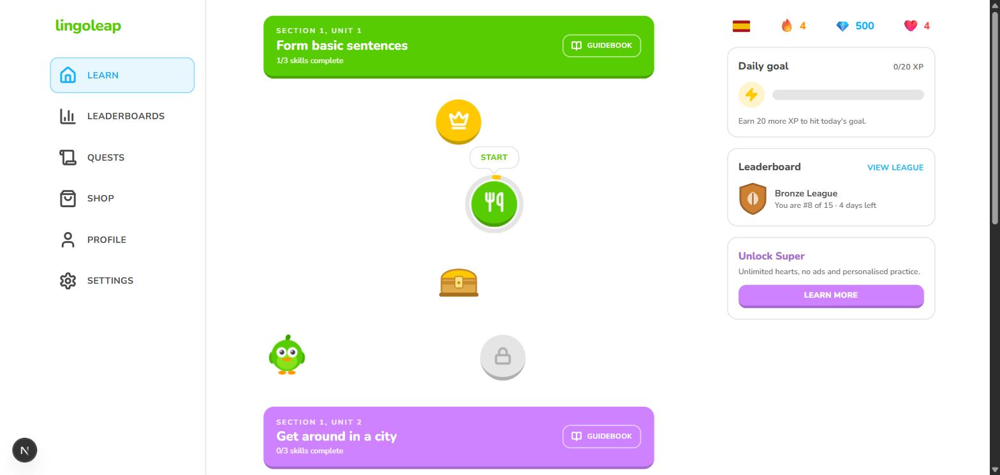
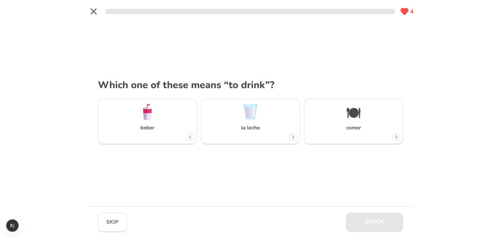
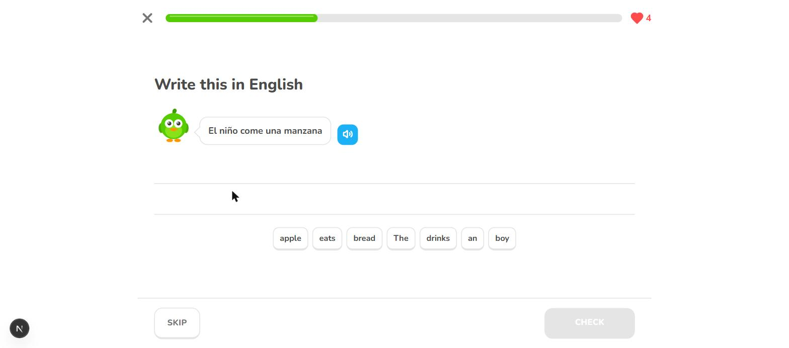
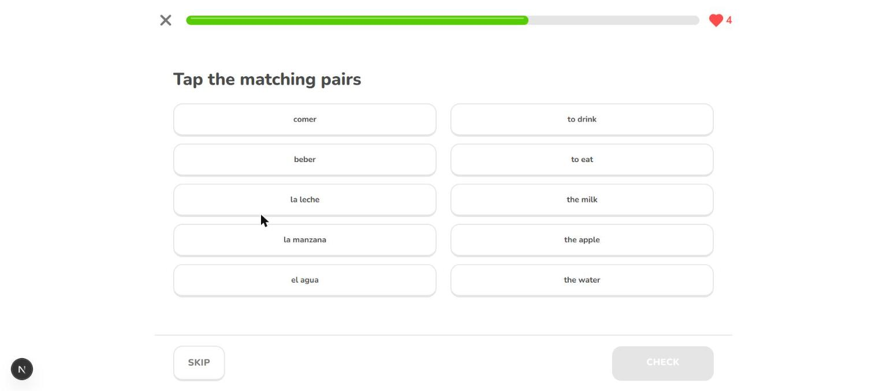
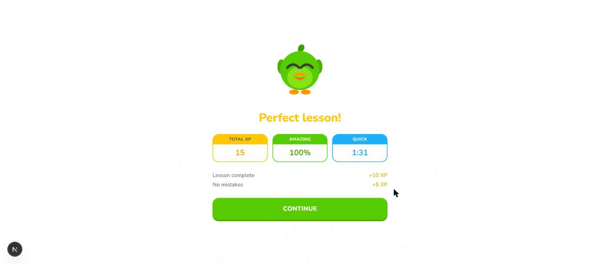
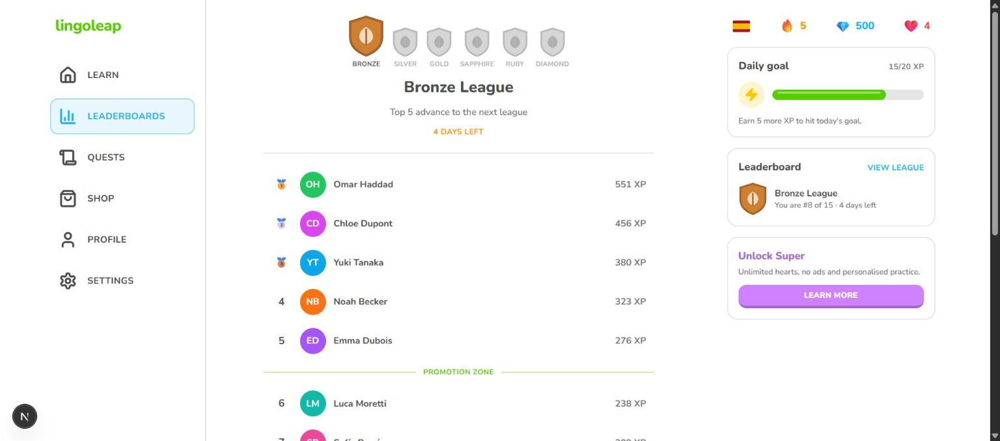
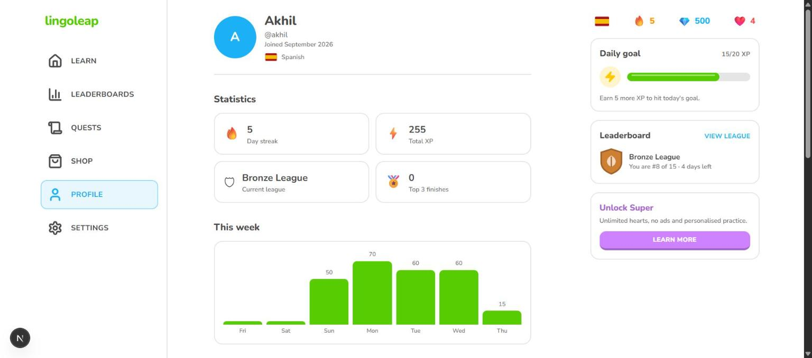
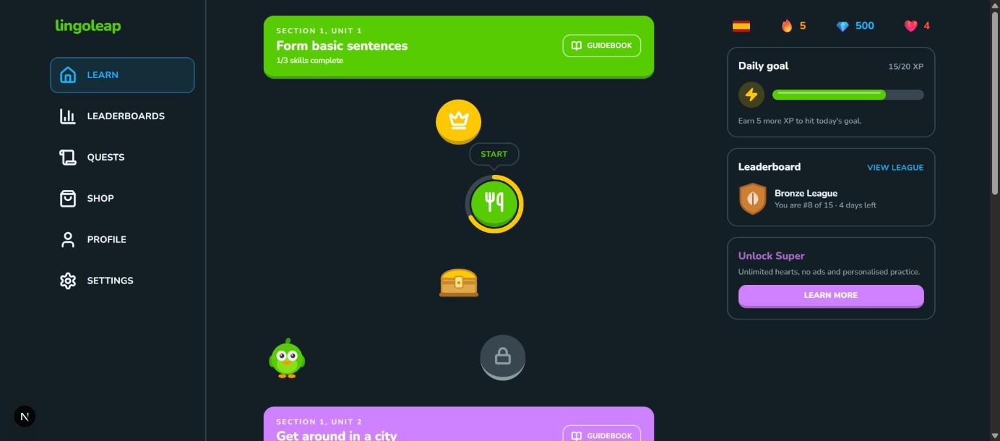
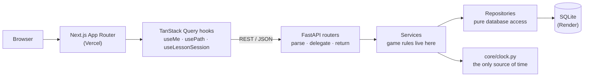
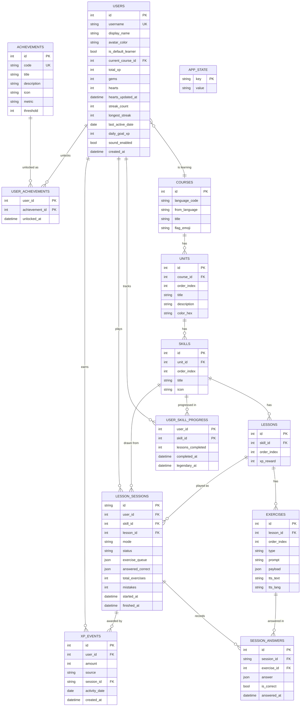

# lingoleap

A functional Duolingo-style web app. Follow a skill path, play lessons built from five kinds of
interactive exercise, earn XP, keep a daily streak alive, spend hearts when you get things wrong
and climb a weekly league. Next.js on the front, FastAPI + SQLite on the back, every rule
enforced on the server.

- **Live demo:** _add your Vercel URL_
- **API docs (OpenAPI):** _add your Render URL_ + `/docs`
- **Repository:** https://github.com/akhil5005/duolingo-clone

| | |
| --- | --- |
|  |  |
| The learning path: zig-zag nodes, crowns, progress rings, chests | A lesson: image cards with number shortcuts |
|  |  |
| Tap-the-words translation with the mascot and text-to-speech | Tap the matching pairs |
|  |  |
| Completion screen with confetti and an XP count-up | The streak screen, only when the streak actually moved |
|  |  |
| Weekly Bronze League with promotion and demotion zones | Profile: statistics, weekly XP, achievements |
|  | |
| Dark mode, applied before the first paint | |

## Features

### Required by the assignment

- **Learning path / skill tree** — units and skills on a zig-zagging path, with
  locked / available / in-progress / completed states derived (never stored), crown progress
  rings, a bouncing START bubble on the current node, decorative chests and mascot flourishes.
  Top bar with streak, XP, gems and hearts, each opening its own popover.
- **Lesson player** — five exercise types (multiple choice, tap-the-words translate, match
  pairs, fill in the blank, type the answer), the signature green/red feedback bar, an animated
  progress bar, a heart lost on each wrong answer with the exercise re-asked later, failure at
  zero hearts, and XP plus skill progress on completion.
- **Gamification** — daily streak with real day logic (plus a simulate-a-day tool), XP totals,
  a seeded weekly league, lazy heart regeneration with a gem refill and a practice mode that
  earns hearts back, a daily XP goal, and everything persisted per learner.
- **Content management** — the whole course (units, skills, lessons, exercises) lives in the
  database and is seeded on first boot; a profile page shows streak, XP and achievements.
- **Duolingo feel** — 3D press-down buttons, rounded bold type, an original mascot with five
  expressions, animated feedback, modals, toasts, confetti and celebratory end screens.

### Bonus

- Text-to-speech on Spanish prompts (browser speech synthesis — no audio files shipped)
- Eight achievements with live progress bars
- A real leaderboard computed from the XP ledger across 15 seeded learners
- Legendary challenge mode (15 exercises, one mistake ends it)
- Dark mode, applied before the first paint so nothing flashes
- Responsive from 375px to desktop; keyboard shortcuts throughout (Enter, 1–9, Backspace)

### Deliberately mocked (marked "Coming soon" in the UI)

Speech recognition, in-app purchases and Super, friends and social features, extra languages.
Authentication is simplified to a single default learner.

## Tech stack

| Layer | Choice |
| --- | --- |
| Frontend | Next.js 15 (App Router), TypeScript `strict`, Tailwind CSS, Framer Motion, TanStack Query v5 |
| Backend | Python 3.11, FastAPI, SQLAlchemy 2.0 (typed `Mapped[]`), Pydantic v2, pydantic-settings |
| Database | SQLite, schema created from the models at startup |
| Tests | pytest + httpx `TestClient` — 77 tests |
| Hosting | Backend on Render (free web service), frontend on Vercel |

## Architecture



Three rules hold the shape together:

1. **Routers contain no logic.** They parse the request, call one service function, commit and
   return a schema. Every rule lives in `services/`, every query in `repositories/`.
2. **The client never decides anything that matters.** Correctness, XP, hearts and progress are
   all computed server-side; answer keys never leave the backend.
3. **All data fetching is client-side.** No server component fetches at build time, so a Vercel
   build never depends on the API host being awake.

### Folder structure

```
backend/app/
├── main.py           # app factory: CORS, routers, error handlers, startup bootstrap
├── core/             # settings, engine/session, the clock, the auth seam, domain errors
├── models/           # SQLAlchemy tables, one module per bounded area
├── schemas/          # Pydantic request/response models + the exercise payload union
├── repositories/     # database access only, no rules
├── services/         # the game: path, lessons, sessions, hearts, streak, XP, achievements
├── api/routes/       # thin HTTP layer
└── seed/             # the Spanish course as JSON + the idempotent seeder

frontend/src/
├── app/              # routes: (main) shell pages and the full-screen lesson player
├── components/       # ui primitives, layout chrome, path, lesson, profile, leaderboard, mascot
├── hooks/            # one hook per query/mutation, plus the lesson reducer
├── lib/              # fetch wrapper, shared types, sounds, formatting, colour helpers
└── styles/           # Tailwind entry and the light/dark design tokens
```

## Database schema



### Table by table

| Table | What it is for |
| --- | --- |
| `courses` → `units` → `skills` → `lessons` → `exercises` | Immutable content, written only by the seeder. Each level is unique on `(parent_id, order_index)`, which is what makes the path deterministic. |
| `users` | One row per learner. `is_default_learner` marks the one this build logs in as. |
| `user_skill_progress` | Composite key `(user_id, skill_id)`. Stores a counter and two timestamps — nothing about locking. |
| `lesson_sessions` | A session in flight: the remaining queue, what has been answered correctly, mistakes, mode and status. |
| `session_answers` | One row per submission. Backs accuracy and makes a session auditable after the fact. |
| `xp_events` | Append-only XP ledger. |
| `achievements` / `user_achievements` | Declarative catalogue plus unlock timestamps. |
| `app_state` | Key/value; currently just the simulated-day offset, so it survives a restart. |

### Key design decisions

- **Lock state is derived, not stored.** Skills are ordered globally by
  `(unit.order_index, skill.order_index)`; skill *n+1* opens when skill *n* is finished. Adding
  content needs no migration and no backfill, and the path can never disagree with progress.
- **`xp_events` is a ledger.** The daily goal, the weekly league and the 7-day chart are all
  aggregations over the same rows, so they cannot drift apart. `users.total_xp` is a
  denormalised running total written in the same transaction, so the common read stays a single
  column lookup.
- **Exercise payloads are JSON, validated by a Pydantic discriminated union.** Five exercise
  types want five different shapes; a JSON column keeps that flexible without five sparse
  tables. The union keyed on `exercises.type` makes it type-safe anyway, and each payload owns
  a `to_public()` that strips the answer key — so correct answers physically cannot reach the
  browser.
- **Sessions live on the server.** The queue, hearts and XP are the server's; the client can
  only submit an answer for the exercise at the head of the queue. XP cannot be minted from the
  console.
- **Composite primary keys on the progress tables** (`user_skill_progress`,
  `user_achievements`) make duplicates impossible at the schema level rather than in code.
- **Foreign keys cascade and are indexed.** SQLite ignores foreign keys unless asked, so
  `PRAGMA foreign_keys=ON` is set on every new connection.

## API

Interactive docs at `/docs` on the backend host.

| Method | Path | Purpose |
| --- | --- | --- |
| `GET` | `/health` | Liveness probe for Render |
| `GET` | `/api/me` | Header state: XP, gems, hearts (regen applied), streak, daily goal, week activity |
| `PATCH` | `/api/me` | Update display name, daily goal or sound |
| `POST` | `/api/me/hearts/refill` | Buy a full set of hearts for 350 gems (`402` if short) |
| `GET` | `/api/path` | The whole course with derived skill states and the next lesson id |
| `POST` | `/api/lessons/{lesson_id}/sessions` | Start a lesson (`409` if locked or out of hearts) |
| `POST` | `/api/skills/{skill_id}/practice` | Practice run; `skill_id = 0` means "anything I have started" |
| `POST` | `/api/skills/{skill_id}/legendary` | Legendary challenge over a finished skill |
| `POST` | `/api/sessions/{id}/answers` | Grade one answer; returns hearts, progress and the new queue |
| `POST` | `/api/sessions/{id}/complete` | Award XP, advance the skill, move the streak, unlock achievements |
| `POST` | `/api/sessions/{id}/abandon` | Quit mid-lesson |
| `GET` | `/api/leaderboard` | Weekly league with promotion and demotion zones |
| `GET` | `/api/profile` | Lifetime stats, achievement progress, seven-day XP series |
| `POST` | `/api/debug/advance-day` | Move the app's clock forward (demo tool) |
| `POST` | `/api/debug/reset` | Rebuild the seeded learner and league |

Errors come back as `{"detail": "human readable", "code": "MACHINE_CODE"}` with `402` for
insufficient gems, `404` for missing resources, `409` for invalid state (locked lesson, no
hearts, wrong exercise, finished session) and `422` for validation.

## Game rules

**Time.** `app/core/clock.py` is the only source of time. `today()` is the current date in
`APP_TIMEZONE` plus a `day_offset` persisted in `app_state`. Because every rule reads it,
"Simulate next day" exercises the real streak and heart logic rather than a mock.

**Progression.** The first skill is always available; skill *n+1* unlocks when skill *n* is
complete. A skill is `locked`, `available` (nothing done), `in_progress` or `completed`.

**Sessions.** Starting a lesson stores its exercise ids as a queue. Each answer must target the
head of that queue. A correct answer pops it; a wrong one pops it and pushes it to the back, so
a missed exercise always comes round again before the lesson can end.

**Hearts.** Maximum 5. Regeneration is lazy, recomputed whenever the learner row is read or
written:

```
gained = floor((now - hearts_updated_at) / HEART_REGEN_MINUTES)
hearts = min(5, hearts + gained)
```

Leftover time is kept — ninety minutes at a sixty-minute rate gives one heart and thirty
minutes of credit towards the next. A wrong answer costs a heart in lesson mode only; zero
hearts fails the session. A refill costs 350 gems. Practice never costs a heart and grants one
on completion.

**Streak.** Finishing any session today: active today → unchanged; active yesterday → +1;
otherwise back to 1. On read, a `last_active_date` older than yesterday means the streak has
broken and it is persisted as 0 — no nightly job required.

**XP.** Lesson: 10, plus 5 for zero mistakes. Practice: 5. Legendary: 40. Each award is one or
more `xp_events` rows plus an increment of `users.total_xp`, in the same transaction.

**Daily goal.** Sum of today's `xp_events` against a goal of 10/20/30/50. The completion
response flags `just_reached` so the celebration fires exactly once.

**League.** Monday to Sunday. Everyone ranked by XP earned this week, ties broken by display
name. Top 5 is the promotion zone, bottom 3 the demotion zone.

**Achievements.** Eight, over five metrics (`lessons_completed`, `streak`, `total_xp`,
`perfect_lessons`, `units_completed`). Metrics are recomputed after every completed session
rather than incremented, so a counter cannot drift from the data it describes.

**Answer checking.** Normalisation lowercases, trims, collapses whitespace and strips
punctuation (including `¿` and `¡`). Typed answers accept an exact match, an accent-insensitive
match (flagged "Pay attention to the accents.") or a single-character edit on answers longer
than four characters (flagged "You have a typo."). Match-pairs is graded on the complete
mapping.

## Local setup

```bash
# backend
cd backend
python -m venv .venv && source .venv/bin/activate   # Windows: .venv\Scripts\activate
pip install -r requirements.txt
cp .env.example .env
uvicorn app.main:app --reload --port 8000           # auto-seeds on first start; docs at /docs

# frontend (new terminal)
cd frontend
npm install
cp .env.example .env.local
npm run dev                                          # http://localhost:3000
```

The database seeds itself the first time it comes up empty. To reseed explicitly:

```bash
cd backend
python -m app.seed.seed            # idempotent top-up
python -m app.seed.seed --reset    # drop every table and start over
```

### Running the checks

```bash
cd backend  && pytest                      # 77 tests
cd frontend && npm run lint && npm run build
```

## Environment variables

### `backend/.env`

| Key | Default | Purpose |
| --- | --- | --- |
| `DATABASE_URL` | `sqlite:///./duolingo.db` | SQLAlchemy URL |
| `CORS_ORIGINS` | `http://localhost:3000,http://127.0.0.1:3000` | Comma-separated allowed origins (trailing slashes are stripped) |
| `CORS_ORIGIN_REGEX` | `https://.*\.vercel\.app` | Also allows Vercel preview deployments |
| `APP_TIMEZONE` | `Asia/Kolkata` | Timezone every date rule uses |
| `HEART_REGEN_MINUTES` | `60` | Minutes per regenerated heart |
| `DEBUG_TOOLS_ENABLED` | `true` | Exposes the `/api/debug/*` demo tools |

### `frontend/.env.local`

| Key | Default | Purpose |
| --- | --- | --- |
| `NEXT_PUBLIC_API_URL` | `http://127.0.0.1:8000` | Backend base URL, no trailing slash |

`NEXT_PUBLIC_*` values are inlined at build time, so changing one on Vercel requires a redeploy.

The local API URL uses the IPv4 literal rather than `localhost` on purpose: Chrome resolves
`localhost` to `::1` first while uvicorn binds IPv4 only, which makes browser requests fail even
though `curl` succeeds.

## Deployment

Both halves run on free tiers and redeploy on every push to `main`. Deploy the backend first —
the frontend needs its URL.

### 1. Backend on Render

Render → **New** → **Web Service** → connect GitHub → select the repository.

| Setting | Value |
| --- | --- |
| Root Directory | `backend` |
| Runtime | Python 3 |
| Build Command | `pip install -r requirements.txt` |
| Start Command | `uvicorn app.main:app --host 0.0.0.0 --port $PORT` |
| Instance Type | Free |
| Health Check Path | `/health` |
| Auto-Deploy | On commit |

Environment variables:

| Key | Value |
| --- | --- |
| `PYTHON_VERSION` | `3.11.9` |
| `DATABASE_URL` | `sqlite:///./duolingo.db` |
| `CORS_ORIGINS` | `http://localhost:3000` (updated in step 3) |
| `CORS_ORIGIN_REGEX` | `https://.*\.vercel\.app` |
| `APP_TIMEZONE` | `Asia/Kolkata` |
| `HEART_REGEN_MINUTES` | `60` |
| `DEBUG_TOOLS_ENABLED` | `true` |

Verify: `https://<service>.onrender.com/health` returns `{"status":"ok"}`, `/api/path` returns
the seeded units, and `/docs` loads.

### 2. Frontend on Vercel

Vercel → **Add New** → **Project** → import the same repository.

| Setting | Value |
| --- | --- |
| Root Directory | `frontend` |
| Framework Preset | Next.js (auto-detected) |
| Build / Install / Output | defaults |
| Env `NEXT_PUBLIC_API_URL` | `https://<service>.onrender.com` (no trailing slash) |

### 3. Connect the two

1. Copy the Vercel production URL.
2. Render → Environment → set `CORS_ORIGINS` to
   `https://<app>.vercel.app,http://localhost:3000` and save (this redeploys).
3. Open the Vercel URL, finish a lesson, refresh, and confirm XP and streak persisted with no
   CORS errors in the console.

### Troubleshooting

| Symptom | Cause | Fix |
| --- | --- | --- |
| Render: `requirements.txt not found` | Root Directory unset | Set it to `backend` |
| Render: `ModuleNotFoundError: app` | Wrong working directory | Root Directory `backend` + the start command above |
| Render: "no open ports detected" | Hard-coded port | `--host 0.0.0.0 --port $PORT` |
| Browser CORS error | Vercel URL missing or trailing slash | Exact origin in `CORS_ORIGINS`, then redeploy |
| Frontend calls `localhost` in production | Env var set after the build | Set `NEXT_PUBLIC_API_URL`, then **Redeploy** |
| Vercel build fails fetching data | Server component fetching at build | All fetching is client-side; keep it that way |
| Vercel: "No Next.js version detected" | Root Directory not `frontend` | Fix the Root Directory |
| Streak does not move after "Simulate next day" | Code bypassed the clock | Use `app/core/clock.py` everywhere |
| Local: browser shows "Failed to fetch", `curl` works | Chrome resolves `localhost` to `::1`, uvicorn binds IPv4 | Use `http://127.0.0.1:8000` in `NEXT_PUBLIC_API_URL` |

## Assumptions and limitations

- **One default learner, no real auth.** `get_current_user` resolves the user flagged
  `is_default_learner`. It is the single seam where a token lookup would go; nothing else in the
  codebase knows how the user was identified.
- **Gems are mocked.** They are seeded, spent on heart refills and never bought.
- **SQLite on Render's free tier is ephemeral.** The file is wiped on every redeploy, restart
  and idle spin-down (after 15 minutes without traffic). The app re-seeds itself whenever the
  database comes up empty, and all seeded dates are generated relative to the current day, so
  the demo always returns alive rather than stale. The production fix is a paid instance with a
  persistent disk, or Postgres — a `DATABASE_URL` change, no code change.
- **Cold starts take up to a minute.** The UI shows a "Waking up the server…" banner once a
  request has been in flight for three seconds, and retries once on a network failure.
- **Match-pairs is graded as a whole.** The client has no answer key, so it cannot judge an
  individual tap. Pairings are provisional and can be undone; the complete mapping is submitted
  once every tile has a partner. A wrong mapping costs one heart, not one per pair.
- **No speech recognition.** Pronunciation exercises are a "Coming soon" placeholder.
  Text-to-speech uses the browser's own voices, so quality varies by device.
- **One language.** Spanish for English speakers: 2 units, 6 skills, 18 lessons, 120 exercises.
- **Original assets only.** The mascot ("Lingo"), the wordmark, the league badge and the chest
  are drawn from scratch as inline SVG. Nunito stands in for Duolingo's proprietary typeface.
  No Duolingo trademarks, artwork or sounds are used.
- **Multiple choice mirrors its question into `exercises.prompt`** so the lesson player can
  render one heading for every exercise type while each payload stays self-describing.

## Future improvements

- Real authentication (the `get_current_user` seam is already there) and multi-user sign-up
- Postgres with Alembic migrations instead of `create_all` on an ephemeral SQLite file
- Spaced repetition: weight practice towards exercises the learner has recently failed, using
  the `session_answers` history that is already recorded
- Real leagues — shard learners into cohorts of thirty with weekly promotion and relegation
- Recorded audio per exercise instead of browser speech synthesis
- Server-side rendering with authenticated data once there is a real session cookie

## AI usage

Built with AI assistance (Claude Code). Every line was reviewed, and the application was
verified end to end in a browser: a full lesson played through all five exercise types, hearts
drained to zero, the out-of-hearts and practice flows exercised, the day simulated forward and
the demo reset.
